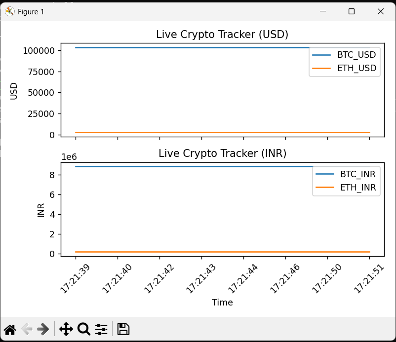

# 💻 Crypto Live Tracker

Hey there! 👋  
This is a small project I made to track live prices of **Bitcoin (BTC)** and **Ethereum (ETH)** in both **USD** and **INR**, using real-time data from the CoinGecko API. It updates every second and shows clean, animated graphs — simple, lightweight, and fun to build.

---

## 🔍 What It Does

- Tracks **BTC** and **ETH** prices live 🌐
- Shows prices in **USD** and **INR**
- Plots both on animated, real-time graphs
- Updates automatically every second ⏱️

---

## 🛠️ Tech Stack

Built using:

- `Python`
- `matplotlib` for plotting
- `requests` for fetching live data
- `pandas` & `numpy` for handling data (lightly)

---

## 📁 Files in This Project

```
crypto_live/
├── main.py             # Main script
├── requirements.txt    # Dependencies
├── freeze              # Just a placeholder file
```

---

## 🚀 How to Run It

If you're trying this on your machine:
## 🚀 How to Run It

### 1. **Clone the Repository**

First, clone the project to your local machine. Open your terminal or command prompt and run the following command:

```bash
git clone https://github.com/yourusername/crypto-live-tracker.git
```
### 2. **Navigate to the Project folder**
```bash
cd crypto-live-tracker
```
### 3. Make sure Python is installed
Download from [python.org](https://www.python.org/downloads/) if needed.

### 4. (Optional) Create a virtual environment
```bash
python -m venv venv
```
Activate it:

- **Windows:** `venv\Scripts\activate`
- **Mac/Linux:** `source venv/bin/activate`

### 5. Install dependencies
```bash
pip install -r requirements.txt
```

### 6. Run the app!
```bash
python main.py
```

It'll launch a real-time plot window showing:

- BTC & ETH prices in **USD** (top graph)
- BTC & ETH prices in **INR** (bottom graph)

---

## 📸 Here's How It Looks



---

## 🧠 Why I Built This

Honestly, I just wanted a quick way to visualize crypto prices without jumping between apps or websites.  
It was also a good excuse to practice API handling, animation with `matplotlib`, and work with real-time data — all in one go.

---

## 📝 Notes

- You need an internet connection (since it fetches live prices).
- If the API fails or rate-limits, the graph just skips that second.
- You can tweak the refresh rate by changing:
  ```python
  interval=1000  # in milliseconds
  ```

---

## ✨ Future Ideas

- Add more coins (DOGE, SOL, etc.)
- Export data to CSV
- Build a simple UI with Tkinter or Streamlit

---

Thanks for checking this out! 😊  
Feel free to fork, improve, or suggest anything.

